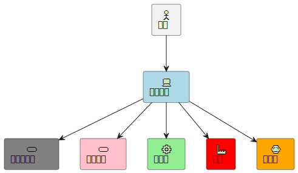
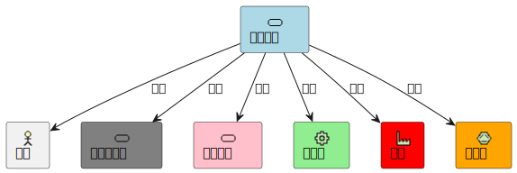
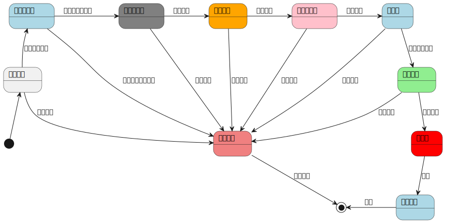
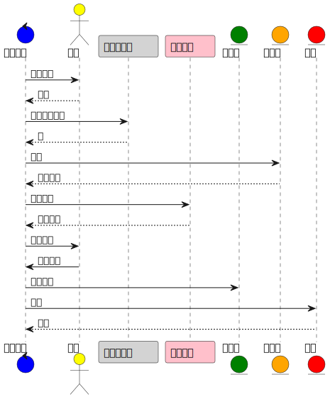
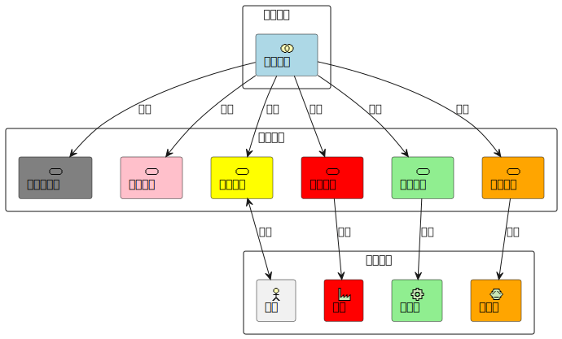
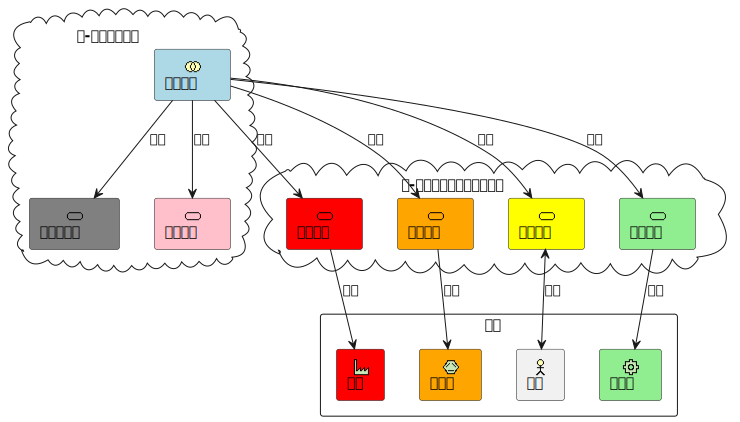
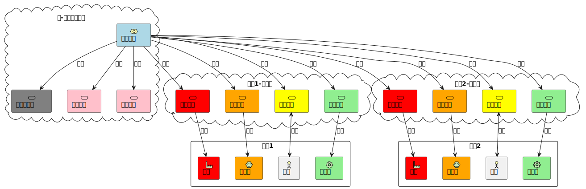
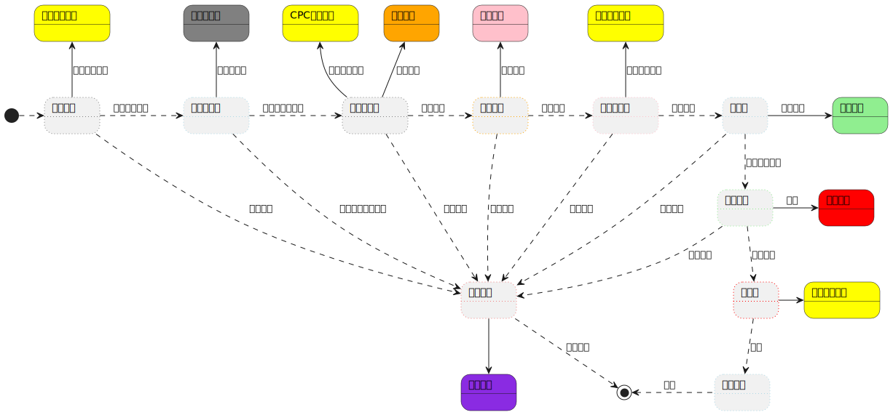
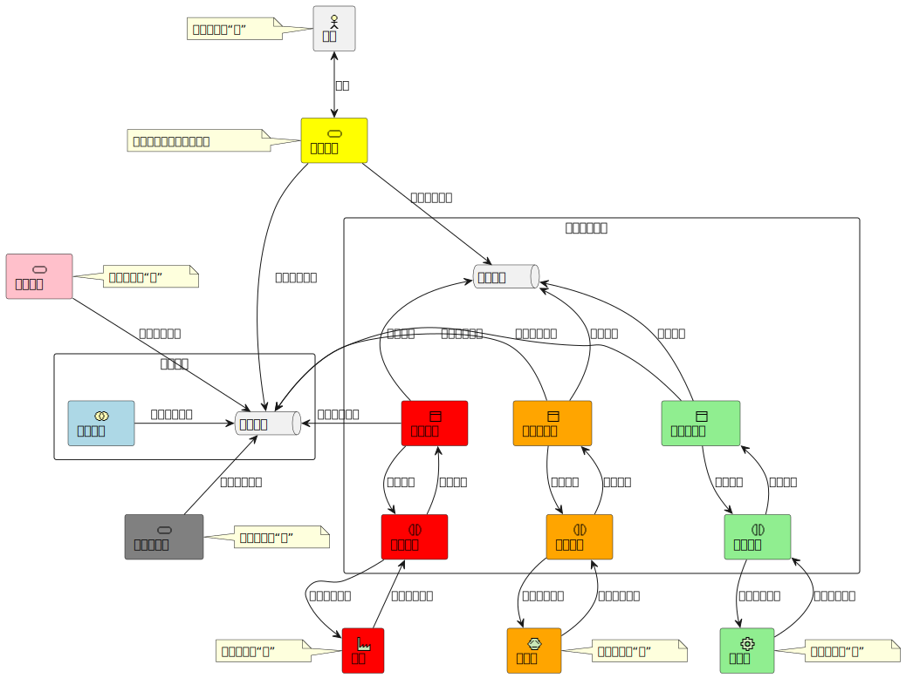
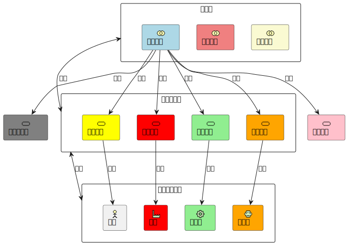

# 人机物融合的云收费架构

## 背景

车道收费软件（MTC）是高速公路收费系统的重要组成。传统MTC实现为桌面应用程序，运行在连接了各种车道可控制设备的工业计算机之上，并部署在车道收费亭内有收费站工作人员进行现场操作。其基本结构如下所示。



## 云收费架构

### 人机物融合
云计算平台技术的发展推动车道收费系统进行技术改造。一方面部分计算/数据密集型业务可以在云端部署运行，发挥云平台资源弹性可伸缩的优势；另一方面借助云计算模式构建面向高速业务的人机物融合应用架构。

传统车道软件实现多层面职责，包括：

1. 设备驱动控制
2. 收费业务过程
3. 用户交互界面

将这些职责进行分离，我们很容易得到以下调整过的架构。



车道业务逻辑在处于核心位置，用户（人）与设备和信息服务在车道业务逻辑协同下完成车道业务。以高速出口的收费业务为例，收费业务逻辑可用状态机建模：



该业务状态机执行过程中，在各参与方根据状态机状态变化而做出相应业务动作并产生业务事件，驱动状态机不断往前直至完成：




当然，作为物理设备的打印机、读卡器、栏杆等和用户并不能直接与车道业务这个信息服务进行交互，所以我们需要在计算机内为每个设备实现一个**设备封装服务**，作为其与信息服务交互的桥梁。这样的封装服务一方面提供与设备交互的软件接口，另一方面镜像了设备的当前（和历史）状态，所以这样的封装服务也可理解为设备的**数字孪生**。对于人来说，他/她与信息世界的交互入口就是我们在计算机上实现的桌面软件（UI），所以上面的架构可以再次细化为：



我们将这种架构称为人机物融合架构。

### 云计算架构

这一逻辑架构可采用以下云计算部署架构：




实际生产环境中，该系统需要服务多条车道，每条车道对应部署边缘节点，多条车道多辆车通行过程中，计费等计算密集型服务又可通过多实例水平扩展保证服务质量，形成以下运行部署。



其与传统桌面应用实现的业务架构相对比存在优势如下：

| 桌面应用架构                                               | 人机物融合架构                                                               |
| ---------------------------------------------------------- | ---------------------------------------------------------------------------- |
| 业务逻辑固化在桌面应用中                                   | 业务逻辑独立运行管理，便于修改管理                                           |
| 设备直接被桌面应用访问，设备无法从外部进行管理             | 设备有其封装服务（或数字孪生）所代表，其状态可以自主上传，其接口可以独立访问 |
| 业务与设备、操作员和其他信息服务间是静态绑定关系，无法更改 | 业务与设备、操作员和服务能动态绑定，运行时可实现各种灵活跨车道业务过程       |

## 数字孪生

如前所述，我们需要为设备开发封装服务，或采用当前流行的数字孪生概念，将设备作为主体纳入信息空间参与业务逻辑所定义的协同过程。实际上我们开发UI系统给用户使用，也是让人在信息空间中被协同，可以看作是信息技术对人的能力/行为的封装。因此UI系统也可以认为是人（用户）的数字孪生，因为它定义了人在业务过程中的行为接口，并可以沉积人的状态并在信息世界中给出反映。

从以上分析我们可以看出，**人机物融合的核心是各类资源的数字化，通过将非信息资源的人和硬件经过服务封装或为其构建数字孪生，使人机物三者成为信息空间中独立且平等的一等实体（first class entity），使之可以在特定应用场景下与其他实体展开协同以实现该场景的业务目标。** 

数字孪生是人机物融合架构下的技术核心点。为设备与人等各类资源实现数字孪生，可在其中封装丰富的高层语义，甚至通过对实体状态数据采集积累，构建反映其本质内涵的数学模型，在信息空间形成自主的现实实体智能投射（projection）。在此基础之上，业务应用开发复杂度可得以降低，开发过程可敏捷化，所实现的业务过程可以更智能化。可以做个类比：让聪明人工作只需要定义宏观目标，他们自能发挥主观能动性和聪明才智既快又好地完成任务，这显然比指挥一群唯唯诺诺的简单事务执行者要完成复杂任务要省劲得多。


当前有若干数字孪生开源系统，例如[Eclipse Ditto](https://www.eclipse.org/ditto/)和[Eclipse Hono](https://www.eclipse.org/hono/)两者结合起来可实现数字孪生的基础功能：通过通信技术与设备进行交互，一方面对其进行遥测（telemetry）获取其状态，另一方面向其发送指令改变其状态。其中Hono提供了[HTTP/MQTT/AMQP协议的通信适配器](https://www.eclipse.org/hono/docs/concepts/connecting-devices)实现，通信网关负责以设备本地协议与其交互，然后转换为Ditto标准适配器所要求的协议上传状态或下达指令。以收费车道栏杆为例：


实际上很多物联网平台也实现类似机制，例如[Thingsboard](https://thingsboard.io)，其[IoT Gateway子项目](https://thingsboard.io/docs/iot-gateway/)给出各类非TCP/IP协议连接设备的网关实现参考。

撇开这些具体系统给出的实现不谈，我们可以把数字孪生理解为某个实体对象的所有可观察属性和可交互接口的集合，或者更直白一点，每个数字孪生包含一组状态值，并可接收若干消息/指令。这些状态值由网关负责采集并汇聚到数字孪生管理系统中，这些消息/指令由网关从数字孪生系统向实体进行转发。

## 业务系统

业务系统实现现实中的一个需求。例如一辆车来到高速出口，我们需要有一个业务系统来完成对其进行收费的过程，正确收到过路费就是这个业务系统直接面对的用户需求。在进行业务场景调研的过程中我们就可以发现，这个系统会运行过程中设计到多个资源，通过有序地与获取资源状态（读取线圈状态以了解车辆位置）或与这些资源交互控制这些资源的状态（发出抬/落杆指令）来完成收费放行这样的业务过程，并最终满足"正确收费"这样的目标。

实现这样的业务系统当然需要开发某种形式的计算机程序来完成这样的有序获知和控制过程。选择一种程序设计语言当然是可以的，也可以采用某种更抽象的业务建模语言，例如业务流程定义语言（BPMN等）或者状态机定义语言（SCXML）等。这些语言可以用面向业务场景的元素简洁地定义业务过程，并在相应的解释器/执行器中进行执行。例如我们之前采用标准UML状态机模型定义每辆车经过收费站时的业务状态变化过程就是后者的一种实现，就建模方法而言，我们可以把整个过程中需要某个资源参与（被使用）的每个阶段定义为一个状态，把资源参与的结果作为从一个状态至另一个状态变迁的事件，如此形成的状态机模型就刻画了收费业务过程执行中资源的协同逻辑。


此处我们选取用状态机进行业务建模，下图展示了在此业务模型下。

>此图只为示意，其中部分细节并不完全合理，例如在“车辆可通行”状态下我们同时启动读卡界面并启动读卡服务，实际上读卡过程中用户界面起到监视读卡过程的作用。更合理的设计方法应该是单独设计一个用户界面，连接到数字孪生系统下直接读取读卡器对应数字孪生体状态。打印、抬杆、黑名单查询、计费等过程皆同。



## 面向数字孪生的业务运行

当状态机开始解释执行时，在不同业务状态下相应的服务被驱动起来，或者相应的用户界面被显示出来。这一驱动过程可以采用传统RPC调用的同步通信方式，或采用事件驱动的异步通信方式。因为状态机的状态变化一般理解为一个事件的发生，所以此例中我们偏向于后者（如果采用流程定义语言建模业务，则偏向于前者，因为流程节点一般理解为启动一个任务的执行）。故此，系统架构可细化为如图所示。



### 小结


以上我们以**人机物融合的技术理念**逐步推导论述了高速收费业务系统的架构设计。与传统ME车道业务系统设计想法的最大区别在于，人机物融合应用架构下ME车道所涉及的各类人机物资源作为一等实体，实体自身的管理与实体在业务场景中被协同应用进行分离，特别是由UI系统所支持人参与业务过程也被同等对待。因此自然而然地以上系统架构图可抽象为三层架构：



从图中可以看出，数字孪生系统在这一架构形式下起到重要作用，它独立与业务存在，在数字孪生层的支撑下各类业务可以直接面向信息空间的数字化实体和服务快速实现，比如大屏展示业务就可以直接基于各个待展示资源对应的数字孪生体所持有的即时数据进行状态展示或基于其历史数据进行统计分析甚至预测。


## 基于数字孪生系统的实现


### 设备连接

前面提到的Eclipse Hono提供了与设备的连接与交互机制，其概念图如下：


我们先采用官方提供的沙盒测试环境进行概念解释和运行验证将一台[小米的空气净化器](https://cdn.cnbj0.fds.api.mi-img.com/b2c-shopapi-pms/pms_1569564998.1585253.jpg
)连接到hono系统中并用ditto建立其数字孪生。

参考Hono[官方文档](https://www.eclipse.org/hono/docs/getting-started/)，我们完成以下几步：

1. [创建租户](https://www.eclipse.org/hono/docs/getting-started/#creating-a-new-tenant)（一个租户相当于一个名空间）；
2. 为空气净化器进行[注册](https://www.eclipse.org/hono/docs/getting-started/#adding-a-device-to-the-tenant)，获得设备标识；
3. 为设备[设置密码](https://www.eclipse.org/hono/docs/getting-started/#setting-a-password-for-the-device)；
4. [下载官方示例应用](https://www.eclipse.org/downloads/download.php?file=/hono/hono-cli-2.3.0-exec.jar)，接收设备所发送的状态数据并给设备发送命令。

完成以上准备工作后，我们来写一个设备网关(Device Gateway)连接净化器将其状态不断发布到Hono中。如下图所示。


该[网关](hono/gw_airpurifier.py)采用python编写。完成之前四步后，我们可以得到hono沙盒实例系统的地址和网络端口，以及我们创建的租户和设备标识。基于这些信息（以及认证等其他信息），我们可以创建一个MQTT的客户端，用以连接到Hono服务。

```python
import paho.mqtt.client as mqtt

hono_mqtt_adaptor_host = "hono.eclipseprojects.io"
hono_mqtt_adaptor_port = 8883

device_id = "2a8f8cc9-1d89-4472-adb4-1a0ce4b47d57"
tenant_id = "d63d9625-4069-476a-827b-7e605754a3d0"

client = mqtt.Client(device_id)
client.connect(host=hono_mqtt_adaptor_host, port=hono_mqtt_adaptor_port,
               keepalive=60, bind_address="")
```
我们为`client`添加两个回调函数：
```python
import json

def on_connect(client, userdata, flags, rc):
    # Subscribing in on_connect() means that if we lose the connection and
    # reconnect then subscriptions will be renewed.
    client.subscribe("$SYS/#")
    client.subscribe("command///req/#")


def on_message(client, userdata, msg):
    cmd = msg.topic.split("command///req//", 1)[1]
    if cmd == "setPower":
        param = json.loads(msg.payload)
        print(param['power'])
        if param['power'] == 'ON':
            purifier.on()
            print("Air Purifier is ON")
        else:
            purifier.off()
            print("Air Purifier is OFF")

client.on_connect = on_connect
client.on_message = on_message
```
然后我们使用python的任务调度器，前者在连接成功时调用，在这个函数中我们向Hono服务端订阅命令消息；后者则在收到这些消息的时候进行响应，例如当前所实现的逻辑为从消息中解析命令并执行。

命令执行过程中我们调用`purifier.on()`和`purifier.off()`，这个purifier对象是我们通过[python-miio](https://github.com/rytilahti/python-miio)这个包中实现的用以连接小米空气净化器的接口，使用起来非常方便。

```python
from miio.integrations.airpurifier.zhimi import airpurifier

purifier = airpurifier.AirPurifier(
    ip="192.168.80.148", token="acf8b3ced11c488f447b5a662ff3cd95")
```

这些完成后，我们即可启动python的调度器，定时从净化器上采集状态，并通过mqtt协议发布到hono的服务端。

```python
import schedule
import time

def pub_telemetry():
    client.loop()
    if client.is_connected():
        result = client.publish("telemetry", json.dumps(
            purifier.status().data, default=vars))
        result.wait_for_publish()

schedule.every(pub_interval).seconds.do(pub_telemetry)

while True:
    time.sleep(1)
    schedule.run_pending()
```

其中的`pub_telemetry()`函数同样用`purifier`对象获得所有`status`并转为json数据对象发送出去。

运行[这段代码](hono/gw_airpurifier.py)
```bash
python3 gw_airpurifier.py
```

在此按照官方文档启动示例应用，一方面我们可以从Hono服务上获得网管推送来的状态数据：
```shell
java -jar hono-cli-2.3.0-exec.jar app -H hono.eclipseprojects.io -P 9094 --ca-file /etc/ssl/certs/ca-certificates.crt -u hono -p hono-secret  consume --tenant ${MY_TENANT}

t 2a8f8cc9-1d89-4472-adb4-1a0ce4b47d57 application/octet-stream {"power": "off", "aqi": 33, "average_aqi": 8, "humidity": 66, "temp_dec": 243, "mode": "idle", "favorite_level": 10, "filter1_life": 100, "f1_hour_used": 0, "use_time": 21138983, "motor1_speed": 0, "motor2_speed": null, "purify_volume": 233750, "f1_hour": 3500, "led": "on", "led_b": 0, "bright": null, "buzzer": "on", "child_lock": "off", "volume": null, "rfid_product_id": null, "rfid_tag": null, "act_sleep": null, "sleep_mode": "idle", "sleep_time": 80198, "sleep_data_num": null, "app_extra": 0, "act_det": null, "button_pressed": null} {orig_adapter=hono-mqtt, qos=0, device_id=2a8f8cc9-1d89-4472-adb4-1a0ce4b47d57, creation-time=1683268031119, traceparent=00-b69c387c00a66a04185f946eb97a7198-154e45c34df9ba28-01, content-type=application/octet-stream, orig_address=telemetry}
e 2a8f8cc9-1d89-4472-adb4-1a0ce4b47d57 application/vnd.eclipse-hono-empty-notification - {orig_adapter=eclipse-hono-adapter-mqtt-5c9888d8c4-bjkfr_17bcd49248de_0, qos=1, device_id=2a8f8cc9-1d89-4472-adb4-1a0ce4b47d57, ttd=0, creation-time=1683268031811, traceparent=00-4989d9a282092f702c34cda3fbf2113f-2b7b9d0577e2ded4-01, content-type=application/vnd.eclipse-hono-empty-notification}
...
```

另一方面我们可以以发送命令的模式运行它

```bash
java -jar hono-cli-2.3.0-exec.jar  app  -H hono.eclipseprojects.io -P 9094 --ca-file /etc/ssl/certs/ca-certificates.crt -u hono -p hono-secret command

hono-cli/app/command> ow --tenant ${MY_TENANT} --device ${MY_DEVICE} -n setPower --payload '{"power": "ON"}'
hono-cli/app/command> ow --tenant ${MY_TENANT} --device ${MY_DEVICE} -n setPower --payload '{"power": "OFF"}'
 ```

从而实现了基于Hono的设备接入管理。这边所使用的示例应用模拟了我们对设备状态获取和命令发送的应用系统，接下来我们把真实的应用纳入进来，也就是数字孪生系统。

### 车道设备网关

我们使用ctypes包来获取车道设备（以下，以抬杆pole为例）dll中的功能函数。
```python
from ctypes import *

poleDLL = CDLL("./MockPole.dll")
```
对于返回类型是C/C++基本数据类型的函数，可直接利用dll中的函数名称对功能进行调用，并获得操作结果
```python
poleDLL.IO_UpAllPoles()
poleDLL.IO_DownOnePole(id)
```
对于C/C++返回的类型是数组的函数，需要使用指针类型返回才能在python中被识别；为了知晓数组的长度，我们在dll中封装了如下数据类型：
```C
typedef struct poles {
    int pole_status[100] = { 0 };
    int pole_num = { 0 };
}poles, *polesPtr;
```
一一对应地，我们在python中也定义该类型：
```python
class PoleStruct(Structure):
    _fields_ = [("pole_status", c_int*100),    # 所有抬杆状态
                ("pole_num", c_int)]           # 抬杆数量
```
这样，我们就可以用以下方式获得抬杆的数量、状态数组:
```python
class Pole:
    def __get_pole_status(self):
        poleDLL.IO_GetPoleStatus.restype = POINTER(PoleStruct)    # 设置从dll中获取抬杆状态函数的返回结果类型
        tempdata = poleDLL.IO_GetPoleStatus()
        pole_num = tempdata.contents.pole_num
        poles_list = []
        for i in range(pole_num):
            poles_list.append(tempdata.contents.pole_status[i])
        return poles_list, pole_num
```
进一步地，对Pole的相关操作函数进行封装，对获取的Pole状态进行json样式的封装，可得到[这段代码](pole-hono/Pole.py)。

与空气净化器示例类似，我们可以得到[抬杆pole网关代码](pole-hono/main.py)，并运行:
```bash
cd pole-hono
python main.py
```
一方面我们可以从Hono服务上获得网关定时推送来的抬杆状态数据：
```shell
java -jar hono-cli-2.3.0-exec.jar app -H hono.eclipseprojects.io -P 9094 --ca-file /etc/ssl/certs/ca-certificates.crt -u hono -p hono-secret  consume --tenant ${MY_TENANT}

t 8eeee125-eaf7-4ccc-a14d-c7fea4f94c2b application/octet-stream {"timestamp": "2023-05-10 21:41:11", "poles": [{"id": 0, "status": 1}, {"id": 1, "status": 1}, {"id": 2, "status": 1}, {"id": 3, "status": 0}, {"id": 4, "status": 0}, {"id": 5, "status": 1}, {"id": 6, "status": 1}, {"id": 7, "status": 1}, {"id": 8, "status": 0}]} {orig_adapter=hono-mqtt, qos=0, device_id=8eeee125-eaf7-4ccc-a14d-c7fea4f94c2b, creation-time=1683726069268, traceparent=00-f7afcf048052aec94ec9f32ffb258513-78aa9aaf0b8aca1e-01, content-type=application/octet-stream, orig_address=telemetry}
...
```
另一方面我们可以以发送命令的模式运行它，并改变抬杆的状态：

```bash
java -jar hono-cli-2.3.0-exec.jar  app  -H hono.eclipseprojects.io -P 9094 --ca-file /etc/ssl/certs/ca-certificates.crt -u hono -p hono-secret command

hono-cli/app/command> ow --tenant ${MY_TENANT} --device ${MY_DEVICE} -n setStatus --payload '{"status":"UP", "id":2}'
hono-cli/app/command> ow --tenant ${MY_TENANT} --device ${MY_DEVICE} -n setStatus --payload '{"status":"DOWN"}'
 ```
从而实现了抬杆设备的数字孪生。

### TODO：UI应用网关


>你手头有什么设备？试着也来写个gateway吧。

### 数字孪生

通过Hono我们实现了物理设备在信息空间的接入和管理，在此基础之上，我们要为设备建立一个独立的数字孪生对象。最简单的数字孪生对象可以理解为包含设备标识和其属性集合的数据对象，与面向对象中的“对象”类似。Ditto是实现数字孪生对象管理的开源平台，我们可以在Ditto上[创建数字孪生(Thing)](https://www.eclipse.org/ditto/protocol-examples-creatething.html)，也可以进行删除、修改等。

在Ditto上创建一个数字孪生，例如我们定义小米净化器，可以给净化器做如下定义：

```json
{
  "thingId": "my-tenant:my-airpurifier-1",
  "features": {
    "status": {
      "properties": {
        "power": {
            "value": ""
        },
        "aqi": {
            "value": 0
        },
        "fan": {
            "value": 0
        }
        ...
      } 
    } 
  }
}
```

这个孪生的各个属性值可以由净化器对应的Hono网关采集，由Ditto连接Hono获取这些值，并更新孪生对象。如下图所示。


此时Ditto就替代了之前Hono中的实例应用。

Ditto官方也提供了沙盒系统供测试所有，但这个沙盒中并没有给测试用户权限去管理Ditto与Hono间的连接，所以我们需要自己部署Ditto。为降低部署复杂性，Eclipse提供了一个打包方案：[Cloud2Edge](https://www.eclipse.org/packages/packages/cloud2edge/)，只需要简单步骤即可在Kubernetes上部署运行完整的Hono+Ditto端到端系统。


### Cloud2Edge下的数字孪生示例

下面，以`minikube`为例，我们搭建一个简易的Hono + Ditto端到端的数字孪生系统。

#### Minikube集群搭建

> 先决条件：
> + 主机具有可以运行Linux容器的虚拟化引擎（如Docker、VirtualBox等）
> + Minikube
> + Helm包管理器
> + kubectl集群管理工具

[Minikube](https://minikube.sigs.k8s.io/docs/)是一个简易的k8s集群搭建工具，可以帮助我们以最快的速度搭建一个单机k8s集群。

按照[说明文档](https://minikube.sigs.k8s.io/docs/start/)安装Minikube后，运行
```bash
minikube start [--addons ingress]
kubectl config use-context minikube
```
其中`ingress`插件用于实现负载均衡，可以根据实际需求决定是否使用。若之后部署的集群服务使用`LoadBalancer`，则此处必须开启。

部署完成后，可以通过`kubectl describe node`检查集群状态，确保正常后，执行：
```bash
export RELEASE=c2e
export NS=cloud
kubectl create ns $NS
```
此处设置了服务的名称和命名空间，为方便后续使用将它们提前导出环境变量。

#### 服务部署

此处，我们使用Eclipse官方提供的[Cloud2Edge]()包，该包可以通过Helm包管理器部署。集群搭建完成后，先添加软件源：
```bash
helm repo add eclipse-iot https://eclipse.org/packages/charts
helm repo update
```

[可选]安装Cloud2Edge时，可以通过编辑`values.yaml`进行自定义设置，示例配置如下：
```yaml
# 定义示例数字孪生
demoDevice:
  tenant: "org.i2ec"
  deviceId: "air-purifier"
  password: "password"

honoConnection:
  username: "ditto-c2e"
  password: "verysecret"

# 连接类型，可选"kafka"或"amqp"
hono:
  messagingNetworkTypes:
  - "kafka"

  # 是否使用LoadBalancer服务
  useLoadBalancer: false
  kafka:
    auth:
      sasl:
        jaas:
          clientUsers:
            - "hono"
            - "ditto-c2e"
          clientPasswords:
            - "hono-secret"
            - "verysecret"
    externalAccess:
      service:
        type: "NodePort"

# ditto服务设置
ditto:
  swaggerui:
    enabled: false
```
该配置创建一个空气净化器的示例数字孪生，并配置了Hono和Ditto之间的Kafka连接。为简便起见，服务均使用`NodePort`方式部署。若要进行进一步自定义，可以参考完整的配置信息[`values.yaml`]()进行调整。

软件源添加完成后，执行
```bash
helm upgrade --install -n $NS [-f values.yaml] --wait --timeout 150m $RELEASE eclipse-iot/cloud2edge
```
若没有自定义`values.yaml`，则不需要指定`-f`选项。由于指定了`--wait`，该命令会一直阻塞终端直至服务完全部署完成或超时失败；若遇到部署失败，重新执行该命令即可。

部署完成后，执行`minikube service list`。若部署成功，则可以得到类似以下的输出：

| NAMESPACE | NAME                            | TARGET PORT      | URL                       |
| --------- | ------------------------------- | ---------------- | ------------------------- |
| cloud     | c2e-adapter-amqp                | amqp/5672        | http://192.168.49.2:32672 |
|           |                                 | amqps/5671       | http://192.168.49.2:32671 |
| cloud     | c2e-adapter-http                | http/8080        | http://192.168.49.2:30080 |
|           |                                 | https/8443       | http://192.168.49.2:30443 |
| cloud     | c2e-adapter-mqtt                | mqtt/1883        | http://192.168.49.2:31883 |
|           |                                 | secure-mqtt/8883 | http://192.168.49.2:30883 |
| cloud     | c2e-ditto-gateway               | No node port     |                           |
| cloud     | c2e-ditto-nginx                 | http/8080        | http://192.168.49.2:31024 |
| cloud     | c2e-kafka                       | No node port     |                           |
| cloud     | c2e-kafka-0-external            | tcp-kafka/9094   | http://192.168.49.2:32094 |
| cloud     | c2e-kafka-headless              | No node port     |                           |
| cloud     | c2e-service-auth                | No node port     |                           |
| cloud     | c2e-service-command-router      | No node port     |                           |
| cloud     | c2e-service-device-registry     | No node port     |                           |
| cloud     | c2e-service-device-registry-ext | http/28080       | http://192.168.49.2:31080 |
|           |                                 | https/28443      | http://192.168.49.2:31443 |
| cloud     | c2e-zookeeper                   | No node port     |                           |
| cloud     | c2e-zookeeper-headless          | No node port     |                           |
| cloud     | ditto-mongodb                   | No node port     |                           |
| ...       | ...                             |                  |                           |


导出URL一列作为服务访问的环境变量，以供后续步骤使用：
```bash
export DITTO_URL=<$RELEASE-ditto-nginx url>
export REGISTRY_URL=<$RELEASE-service-device-registry-ext http-url>
export MQTT_ADAPTER_URL=<$RELEASE-adapter-http mqtt-url>
```

#### 自定义数字孪生

服务部署完成后，即可添加实际的数字孪生实例。以空气净化器为例，我们使用服务部署时的`demo-device`作为数字孪生示例。

首先为定义数字孪生模型：
```bash
curl -i -X PUT -u ditto:ditto -H 'Content-Type: application/json' --data '{
  "features": {
    "status": {
      "properties": {
        "power": {
            "value": "off"
        },
        "aqi": {
            "value": 0
        },
        "led": {
            "value": "off"
        }
      } 
    }
  }
}' http://$DITTO_URL/api/2/things/org.i2ec:air-purifier

```

添加完成后，可以验证一下：
```bash
curl -i -u ditto:ditto http://$DITTO_URL/api/2/things/org.i2ec:air-purifier
```
此时得到的输出应为：
```
HTTP/1.1 200 OK
correlation-id: bc45c11f-03e1-4868-a3ff-1d8700058af8
...

{"thingId":"org.i2ec:air-purifier","policyId":"org.i2ec:air-purifier","features":{"status":{"properties":{"power":{"value":"off"},"aqi":{"value":0},"led":{"value":"off"}}}}}
```

若添加其他设备，则可以参考[文档](https://www.eclipse.org/packages/packages/cloud2edge/tour/)进行，该过程不算复杂，故不在此处重复。

#### 设备端连接

经过上几节的努力，我们已经完成了数字孪生系统在Cloud端的部署和自定义。本节，我们将以空气净化器为例完成Edge端设备逻辑代码的编写，使其能够完成现实中的任务。

Edge端设备与Hono的连接是通过Adapter服务进行；该服务可以理解为一个Gateway，通过验证设备的`credentials`确定Cloud端与之对应的数字孪生，进而获取访问权限并建立通信。Adapter服务支持多种协议如`MQTT`、`AMQP`、`HTTP`等，但实际用法大同小异。其中，`MQTT`协议作为一个轻量的消息队列协议，在嵌入式领域具有广泛的应用；因此在本例中，我们使用`MQTT`作为示范。

Edge端设备在创建时，会指定其`auth-id`和`password`。登陆Adapter时，用户名为`auth-id@tenant-id`，密码为`password`。
```python
device_id = "org.i2ec:air-purifier"
auth_id = "air-purifier"
tenant_id = "org.i2ec"
device_pwd = "password"

client = mqtt.Client(device_id)
client.username_pw_set("f{auth_id}@{tenant_id}", device_pwd)
```

#### 设备端消息收发

设备端的消息接收发送均需要满足[Ditto Protocol](https://www.eclipse.org/ditto/protocol-overview.html)。设备端接收和发送的消息可以分为`command event`、`command response`、`telemetry`三种。

`command event`消息总为`application/json`类型，其大致内容为
```json
{
    "topic": "<namespace>/<thingName>/things/<channel>/commands/<command>", // 包含ThingId和命令内容，此处也可以为消息
    "path": "<path>", // 一般为更改的属性的json path
    "value": "...", // command或消息的负载
    "headers": {
        "correlation-id": "..." // 对应command的correlation_id
    }
}
```

`command response`消息为Edge设备向Cloud发送的命令回复内容，其形式可以自定义；但需要在请求头中加入对应命令的`correlation-id`，用于ditto追溯客户端请求。具体地，一个`command response`大致内容为
```json
{
  "topic": "...",
  "path": "...", // 回复命令的topic和path，一般和原命令一致即可
    "headers": {
    "correlation-id": "xxx" // 需要回复的命令的correlation_id
  },
  "value": {
    "starting-watering": true
  }, // 此处value代表实际回复的负载
  "status": 200 // 命令的执行状态码，语义参考HTTP状态码
}
```

`telemetry`此处是相对Edge设备而言；相对Cloud端，设备发送的其实也是一种`command`，因此其内容与`command event`一致。

设备通过`MQTT`客户端即可订阅和发布消息，从而参与到数字孪生系统中并完成对应的工作。下面，我们定义一个空气净化器的基本职责：
+ 每隔一段时间（如5分钟，向Cloud端推送空气指数和设备状态）。
+ 用户可以通过访问Cloud端获得设备状态。
+ 用户可以通过访问Cloud端，远程控制设备的开启和关闭以及LED状态。

一个简单的实现可见[local_airpurifier.py](cloud2edge/local_airpurifier.py)。

#### 用户：在Cloud端访问和控制Edge端设备

在完成Cloud和Edge端服务搭建后，用户可以通过Cloud端提供的Restful服务直接获取设备状态和操作设备。下面给出几个空气净化器操作示例：

获取设备状态：
```bash
curl -i -u ditto:ditto http://$DITTO_URL/api/2/things/org.i2ec:air-purifier
```
此时返回设备的运行状态：
```json
{
  "thingId": "org.i2ec:air-purifier",
  "policyId": "org.i2ec:air-purifier",
  "features": {
    "status": {
      "properties": {
        "power": {"value": "off"},
        "aqi": {"value": 22},
        "led": {"value": "on"},
      }
    }
  },
}
```

开启空气净化器：
```bash
curl -i -X POST -u ditto:ditto -H 'Content-Type: application/json' -w '\n' --data '{
  "power": "on"
}' http://$DITTO_URL/api/2/things/org.i2ec:air-purifier/inbox/messages/power?timeout=0
```
此时，Ditto会将信息传给Hono后经过MQTT将消息发送至设备，设备根据得到消息的负载执行开机操作。

以上，我们利用Cloud2Edge制作了一个简单的空气净化器数字孪生。
